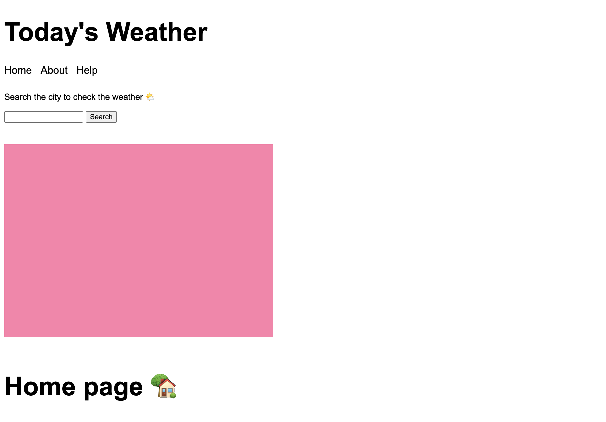
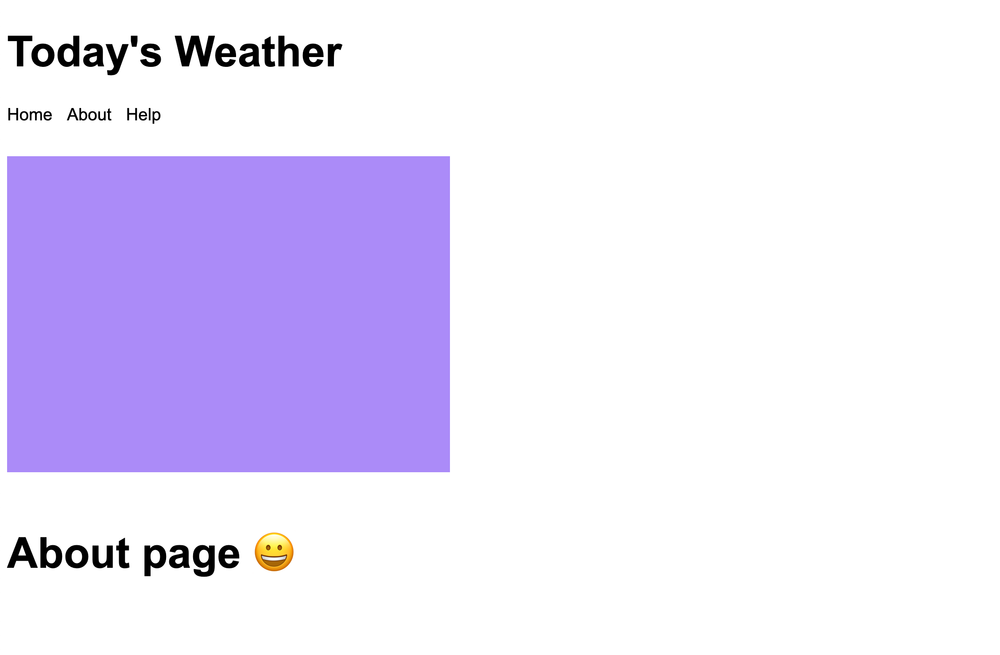

## Screenshots




## Quick Start

Basics of express.js application

  Install dependencies:

```console
$ npm install
```

  Start the server:

```console
$ node src/app.js
```


## Todo

- [ ] Hosting the app 